## 一、个人推荐

结合大语言模型（LLM）生成各类绘图场景下，遵循**效率优先、样式统一**标准。基于此的个人体验和推荐如下：

* 效率：mermaid&gt; next-ai-drawio&gt; drawio&gt; cursor-drawio
* 美化：cursor-drawio/ drawio&gt; next-ai-drawio&gt; mermaid.chart&gt; mermaid
* **推荐**：**next-ai-drawio&gt; mermaid&gt; drawio&gt; cursor-drawio** 

## 二、工具对比

|                         工具                         | 推荐场景                                                                                               | 示例图                                                                                                                                                                                  |
| :------------------------------------------------: | :------------------------------------------------------------------------------------------------- | :----------------------------------------------------------------------------------------------------------------------------------------------------------------------------------- |
|      [mermaid](http://mermaidchart.com/play)       | 常见流程图、时序图、甘特图绘制&lt;br&gt;针对样式无太大调整需求，可配置大模型快速生成代码&lt;br&gt;**推荐 MermaidChart 模式**，样式相对更美观          | 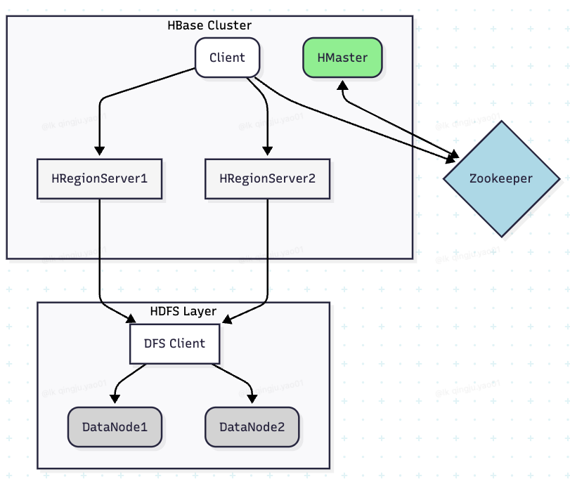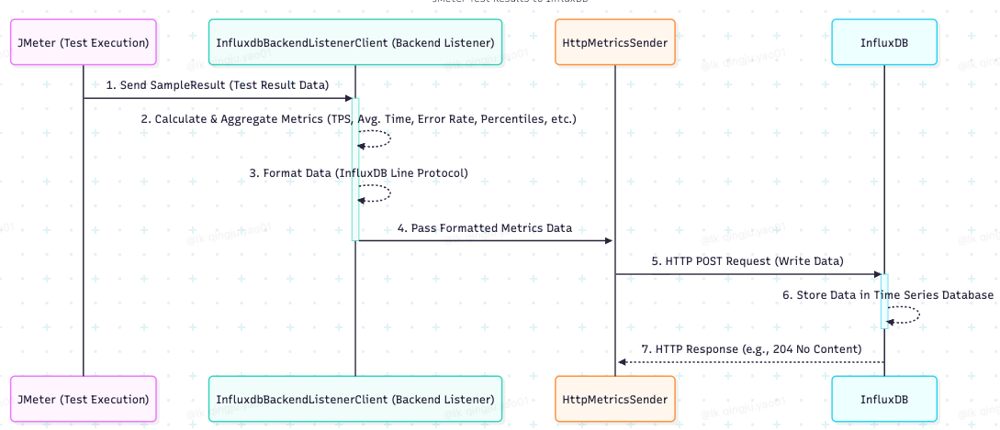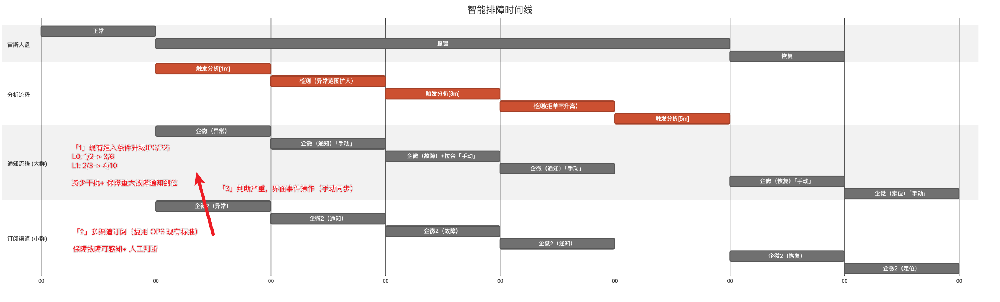 |
|        [draw.io](https://app.diagrams.net/)        | 灵活绘图，有丰富使用模板，但细节调整较费时&lt;br&gt;针对 git、思维图、流程图等格式模板，也很适合大模型快速生成&lt;br&gt;上限较高，支持灵活定制，优于 processon 等 | 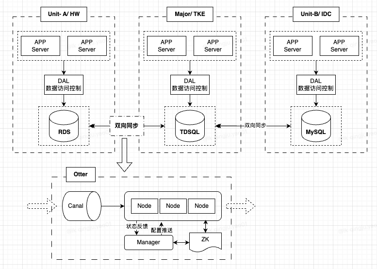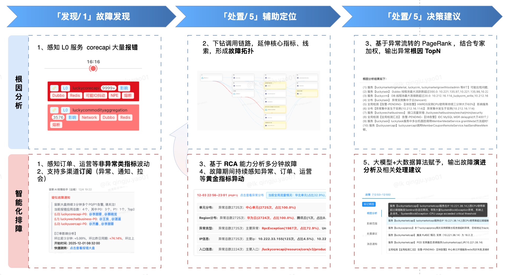                                                             |
| [next-ai-drawio](https://next-ai-drawio.jiang.jp/) | 基于 mermaid 格式数据快速生成 next 样式制图&lt;br&gt;较好地平衡了生成效率和美观度（Next 风格），mermaid 代码丢进去后基本调整下线条、位置即可          | 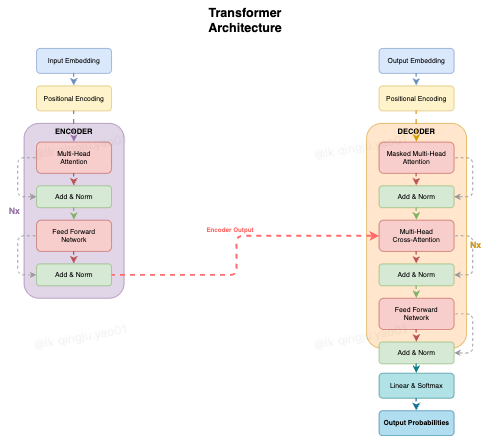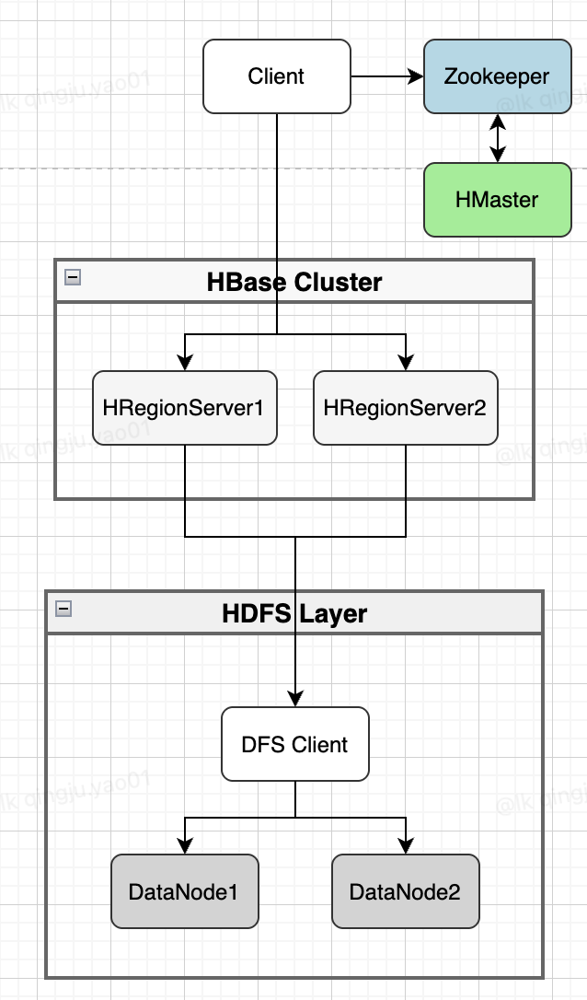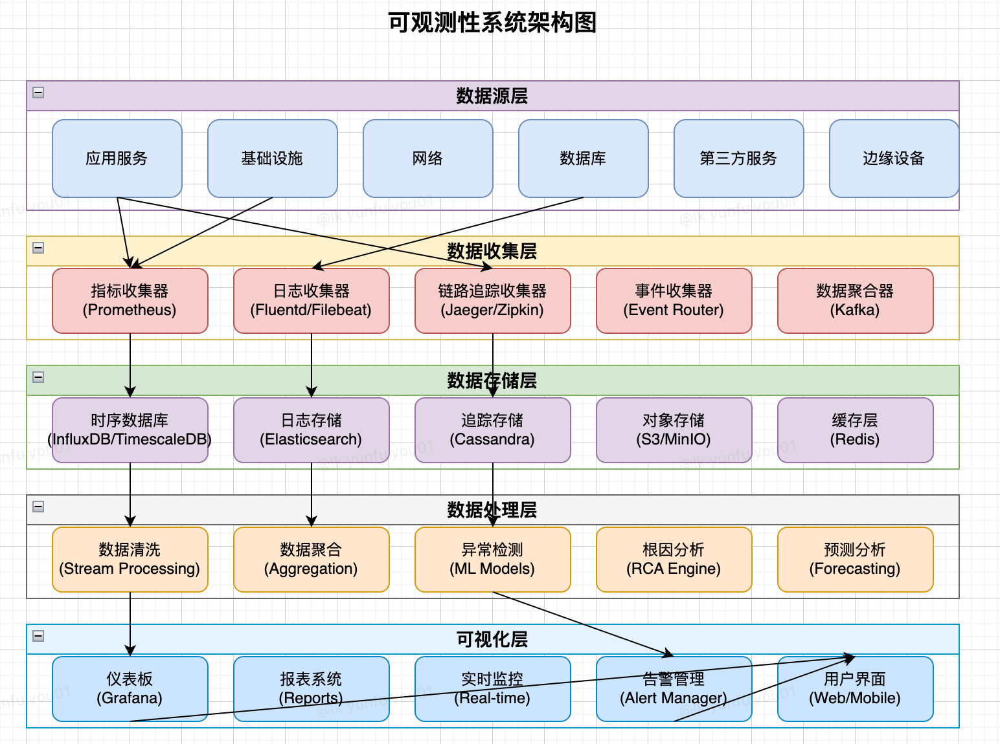 |
|                  cursor + mermaid                  | 比较适合于**样式统一且规范**场景，如架构图&lt;br&gt;个人体验下，适用于偏原生组件场景的样式复用                                             | 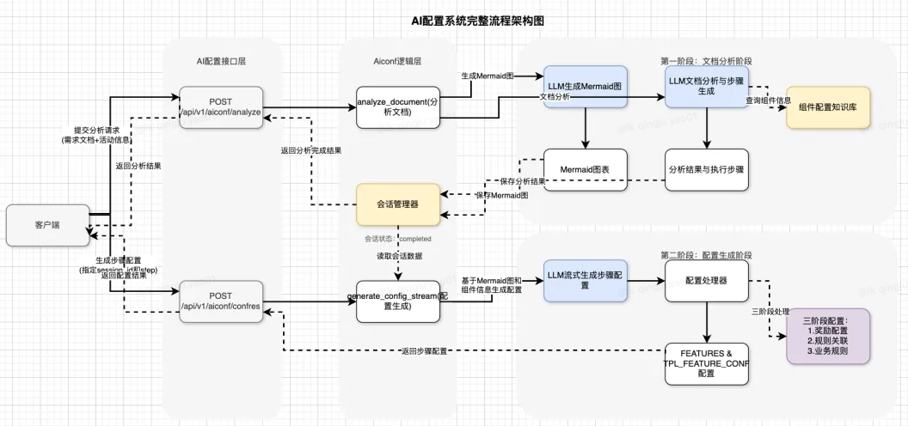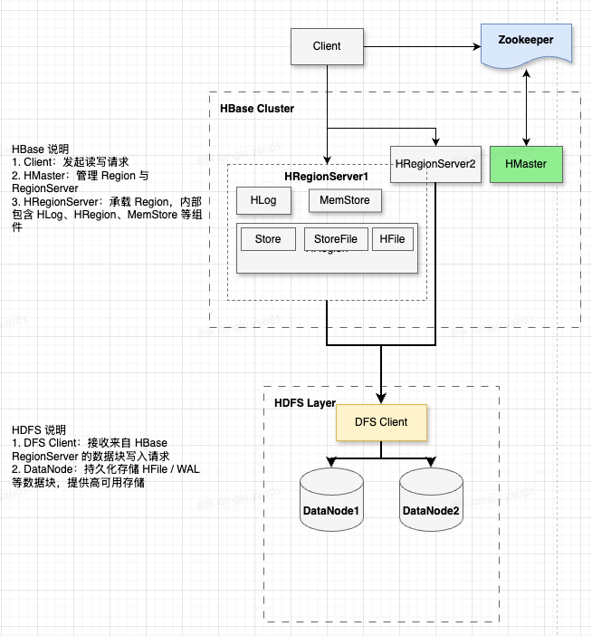                                                             |

## 三、流程介绍

本章节重点介绍 `cursor + mermaid` 方案，如何利用 **Cursor Agent** 结合 **Draio.io 插件**实现高效、规范的绘图工作流。

### 3.1. 整体思路

使用 Cursor Agent 工具，实现 mermaid 代码基于 mdc（Markdown Code Fence）规范的结果输出；配合 Draw.io Integration 插件实现在 Curosr 端直接显示、修正。
其中 mdc 规范可让大模型根据模板 drawio 样式图来制定，并结合复用场景进行抽象化、使用中调整提示词的**二次迭代**，来保障规则的匹配度。

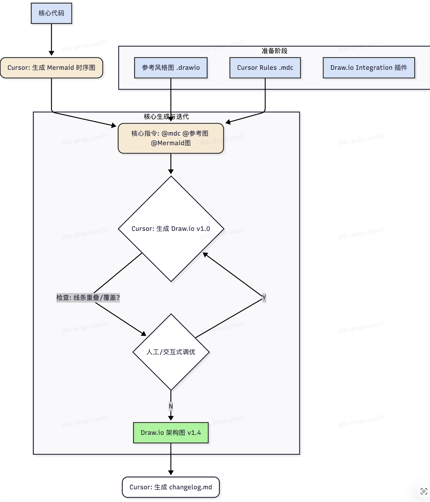

### 3.2. 验证示例

原文参考：[三七互娱技术团队/还在手绘drawio？用Cursor让你的画图效率起飞](https://mp.weixin.qq.com/s/6pb1ZuGka2jAUgq4WBRcsg)
此处使用的是 `LK-DB_Otter` 架构图作为模板，来生成 `HBase` 场景架构图。

#### 3.2.1. 准备工作

* **环境**：Cursor
* **插件**：Draw.io Intergration
* **模板**：
    * mermaid 代码/ `hbase.mmd`（可使用大模型直接生成）
    * drawio 原型/ `template.drawio`（历史风格文件）
    * cursor 规则/ `template.mdc`（可使用大模型基于模板样式图来生成、并基于后续提示词改进）

#### 3.2.2. 关键步骤

1.  通过大模型生成 HBase 架构图（含 HDFS 模块） Mermaid 代码文件   hbase.mmd
2.  基于 LK-DB_Otter 截图生成 cursor 执行规则 template.mdc
3.  基于 template.drawio + hbase.mmd + template.mdc 生成 hbase.drawio 文件
    ```shell
    使用 drawio 插件为 @hbase.mmd  生成 drawio 文件，要求样式参照 @template.drawio  而具体规则参考 @template.mdc
    ```
4.  后缀通过需求补充、手动调整生成最终版

#### 3.2.3. 横向对比

|                                                                           官方版本                                                                            |                                                                        Mermaid 版本                                                                         |                                                                      Cursor 版本（含变更）                                                                       |
| :-------------------------------------------------------------------------------------------------------------------------------------------------------: | :-------------------------------------------------------------------------------------------------------------------------------------------------------: | :-------------------------------------------------------------------------------------------------------------------------------------------------------: |
| 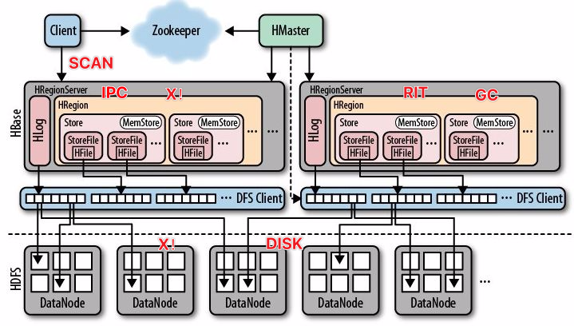 | 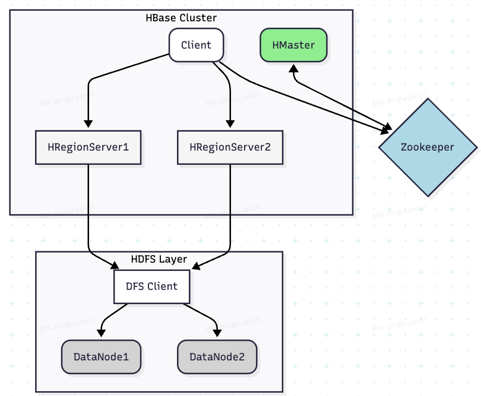 | 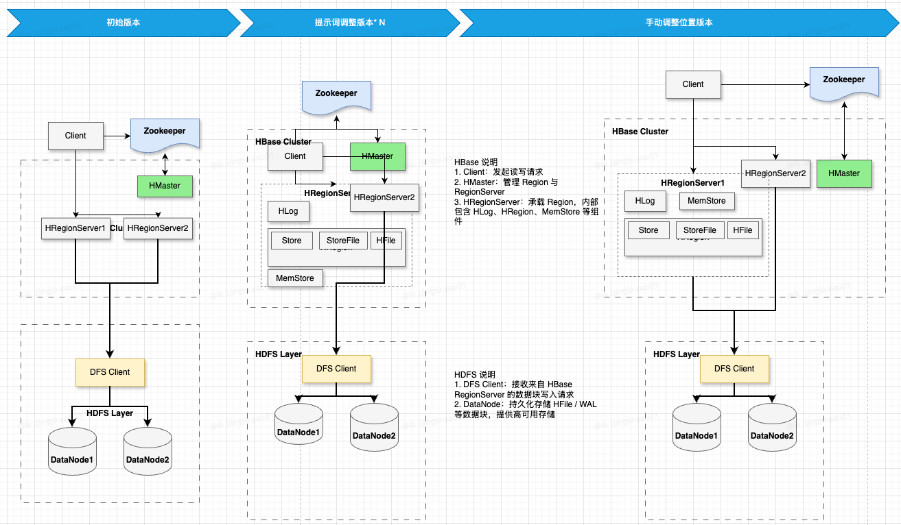 |

## 四、参考资料

* draw.io
    * [draw.io 模板](https://www.drawio.com/example-diagrams)
    * [可视化操作界面](https://app.diagrams.net/)
* next-ai-drawio
    * [github/ next-ai-draw-io](https://github.com/DayuanJiang/next-ai-draw-io)
    * [可视化操作界面](https://next-ai-drawio.jiang.jp/)
* cursor-drawio
    * [三七互娱技术团队/还在手绘drawio？用Cursor让你的画图效率起飞](https://mp.weixin.qq.com/s/6pb1ZuGka2jAUgq4WBRcsg) 


